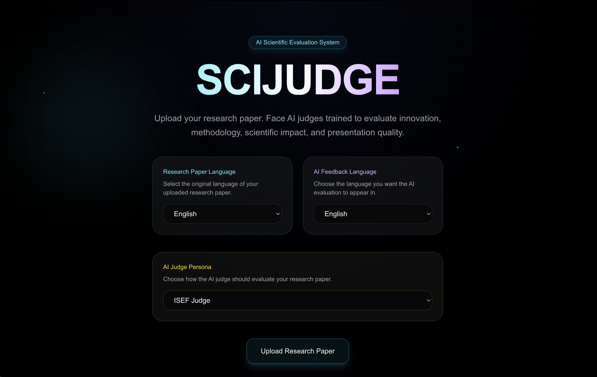

# SCIJUDGE AI

SCIJUDGE AI is an AI-assisted platform designed to support the evaluation of scientific research papers. It provides structured feedback and scoring based on common judging criteria, helping students, researchers, and science fair judges review papers more efficiently.

The project is currently under active development.

---

## Features

- Upload research papers in PDF format
- AI-assisted evaluation
- Overall research score
- Category-based scoring
- Strengths and weaknesses analysis
- Detailed evaluation report
- Evaluation history
- Multi-language support
- Modern responsive interface

---

## Tech Stack

### Frontend

- Next.js
- React
- TypeScript
- Tailwind CSS

### Backend

- FastAPI
- Python

### AI

- Large Language Model API

---

## Getting Started

### Clone the repository

```bash
git clone https://github.com/YassinAliElDeeb/SCIJUDGE-AI.git
cd SCIJUDGE-AI
```

### Backend

```bash
cd backend

python3 -m venv venv
source venv/bin/activate

pip install -r requirements.txt

uvicorn main:app --reload
```

### Frontend

```bash
cd frontend

npm install
npm run dev
```

Open:

```
http://localhost:3000
```

---

## Project Structure

```
SCIJUDGE-AI
│
├── backend/
│
├── frontend/
│
└── README.md
```

---
## Screenshots

### Home Page

<p align="center">
  
</p>

---
## Roadmap

- User authentication
- Cloud deployment
- PDF report export
- Research comparison
- Improved evaluation criteria
- Performance optimization

---

## Contributing

Contributions, ideas, and feedback are always welcome. Feel free to open an issue or submit a pull request if you'd like to improve the project.

---

## Author

Yassin Ali

GitHub:
https://github.com/YassinAliElDeeb

Linktree:
https://linktr.ee/yassin.ali

LinkedIn:
https://www.linkedin.com/in/yassinali30/

---

## License

This project is licensed under the MIT License.
